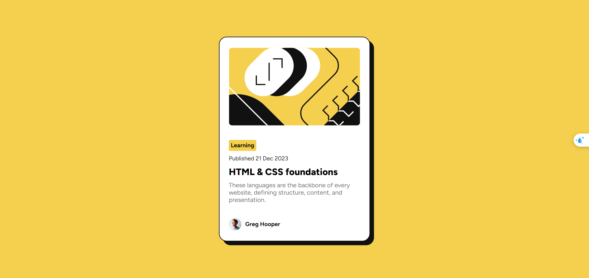

# Frontend Mentor - Blog preview card solution

This is a solution to the [Blog preview card challenge on Frontend Mentor](https://www.frontendmentor.io/challenges/blog-preview-card-ckPaj01IcS). Frontend Mentor challenges help you improve your coding skills by building realistic projects. 

## Table of contents

- [Overview](#overview)
  - [The challenge](#the-challenge)
  - [Screenshot](#screenshot)
  - [Links](#links)
- [My process](#my-process)
  - [Built with](#built-with)
  - [What I learned](#what-i-learned)
  - [Continued development](#continued-development)
  - [Useful resources](#useful-resources)
- [Author](#author)
- [Acknowledgments](#acknowledgments)

**Note: Delete this note and update the table of contents based on what sections you keep.**

## Overview

### The challenge

Users should be able to:

- See hover and focus states for all interactive elements on the page

### Screenshot

### Links

- Solution URL: [Add solution URL here](https://your-solution-url.com)
- Live Site URL: [BlogReviewCard](https://scp0999.github.io/BlogReviewCard/)

## My process

### Built with

- Semantic HTML5 markup
- CSS custom properties
- Flexbox

### What I learned

1. Remember back that we have shadow-box in css and how to use it.
2. Try and using local variable in css.
3. Little responsive on font-size and size of the content.
4. Using hover and smooth the transition.

### Continued development

1. Continue to use local variable as a habbit.
2. Try using Grid. 
3. Learn more to responsive the web with Grid.

### Useful resources

My best friend is Google and the AI. Always choose the first link pop up though.

- [Coder Coder Youtube chanel](https://www.youtube.com/@TheCoderCoder) - This helped me for help a lot to get a clear view what step to do to build a website.

## Author

- Frontend Mentor - [@scp0999](https://www.frontendmentor.io/profile/scp0999)

## Acknowledgments

This is where you can give a hat tip to anyone who helped you out on this project. Perhaps you worked in a team or got some inspiration from someone else's solution. This is the perfect place to give them some credit.

**Note: Delete this note and edit this section's content as necessary. If you completed this challenge by yourself, feel free to delete this section entirely.**
